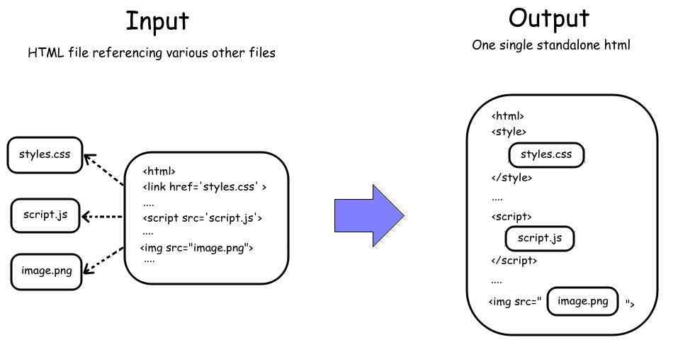

What is this?
==============
Program to Merge JS/HTML into one single html file.

Usage
=====
Usage:
  `python3 htmlmerger inputfile [optional: outputfile]`

Dependencies
============
Uses only python-native libraries

TODO
=====
 - clean up code (?) ... this will never happen :D
